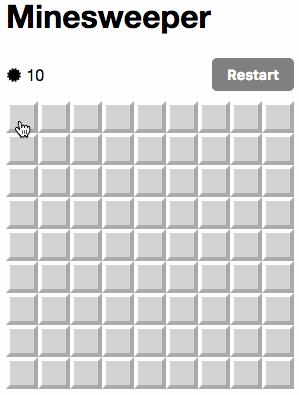

# React Minesweeper

A React clone of Minesweeper.

[Demo](https://saitoxu.io/playground/react-minesweeper)



## Development

```sh
$ git clone https://github.com/saitoxu/react-minesweeper.git
$ cd react-minesweeper
$ yarn install
$ yarn start
```

## Contributing

Changes and improvements are more than welcome! Feel free to fork and open a pull request. Please make your changes in a specific branch and request to pull into `master`! If you can, please make sure the game fully works before sending the PR, as that will help speed up the process.

## TODO

- Count elapsed time
- Add question mark
- Improve design
- Refactoring

## License

[MIT](http://opensource.org/licenses/MIT)

Copyright (c) Yosuke Saito 2017
